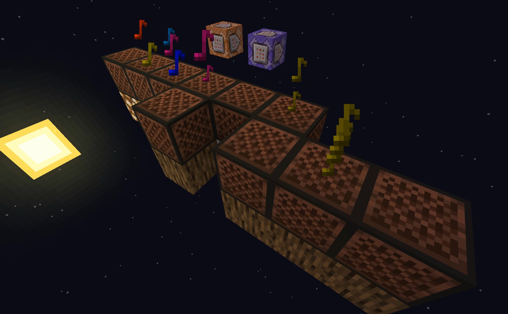

# Midi2McFunction


Midi 파일을 읽어 마인크래프트의 데이터 팩 함수`.mcfunction` 으로 변환합니다.

흔히 유튜브 등지에서 볼 수 있는 음악을 구성하는 모든 노트가 별개 노트블럭으로 구성되는 방식이 아닌, 하나의 반복 커맨드 블럭에 `.mcfunction`을 연결하고 여러 노트블럭을 재활용하기 때문에 정해진 위치에서 플레이됩니다.

최대한 마인크래프트에서 쉽게 쓸 수 있도록 하나의 `.mcfunction` 파일에 모든 내용을 집어넣었고, 덕분에 하나의 반복형 커맨드 블록에 .mcfunction 을 연결하는 것만으로 사용이 가능하지만 성능상 이점은 챙기지 못했습니다.

오히려 이렇게 많은 커맨드들을 매 틱마다 전혀 지장없이 수행해주는 마인크래프트가 갓겜이라는 것만 증명된 것 같습니다...

### config.json
~~겁나 복잡하고 어려움~~ ~~3차원 배열 실화?~~
다음 타입을 가집니다:
```typescript
type ArcticConfiguration = {
    note_blocks: [number, number, number][][]
    power_blocks: [number, number, number][][]
    base_blocks: (string | null)[] | null
    padding_end: number
    internal_name: string
    input_name: string
    output_name: string
}
```
- `note_blocks`  
  노트블럭들이 배치될 좌표입니다. 노트블럭을 재활용하기 때문에 우선 트랙으로 나누고 트랙 안에서도 화음이 있으면 그 화음을 구성하는 음의 수만큼의 노트블럭이 필요합니다.
  - 가장 안쪽의 세 number 를 가지는 튜플은 좌표를 나타냅니다.
  - 그 튜플들의 배열은 하나의 트랙 내에서 사용될 노트블록들의 좌표 집합으로, '가장 많은 음으로 구성된 화음의 구성 음 수'의 길이를 가져야합니다.
  - 위의 배열이 다시 모여 여러 트랙 내에서 사용될 노트블록들의 좌표집합이 됩니다.  

  예제 값:
    ```json
    [
        // 0번 트랙을 구성하는 노트블럭들의 좌표 (최대 3개의 음으로 이루어진 화음이 있음)
        [[-2, 0, 2], [-3, 0, 2], [-4, 0, 2]], 
  
        // 1번 트랙을 구성하는 노트블럭들의 좌표 (최대 3개의 음으로 이루어진 화음이 있음)
        [[-1, 0, 2], [1, 0, 2], [0, 0, 2]],
  
        // 2번 트랙을 구성하는 노트블럭들의 좌표 (최대 2개의 음으로 이루어진 화음이 있음)
        [[2, 0, 3], [3, 0, 3]],
  
        // 3번 트랙을 구성하는 노트블럭들의 좌표 (최대 3개의 음으로 이루어진 화음이 있음)
        [[-1, 0, 3], [1, 0, 3], [0, 0, 3]]
    ]
    ```
- `power_blocks`  
  노트블럭을 활성화하기 위한 레드스톤 블럭을 배치할 좌표입니다. 배열의 의미는 `note_blocks`와 동일합니다.  
  예를 들어 `power_blocks[0][0]`의 좌표는 `note_blocks[0][0]` 을 활성화하기 위한 레드스톤의 배치 좌표가 됩니다.  
- `base_blocks`  
  트랙별로 악기가 고정된 경우, 각 트랙별로 노트블럭 아래에 악기를 설정하기 위한 블럭들이 설치할 수 있습니다.  
  값 자체에 `null`을 주거나(모든 트랙), 배열의 요소에 `null`을 주면(특정 트랙) 그 트랙에는 배치하지 않습니다. 
  예시 값: 
    ```json
    ["iron_block", null, "oak_wood", null]
    ```
- `padding_end`  
  곡이 끝난 이후에 다시 재생이 시작되기까지의 간격입니다.
  0으로 줄 경우 곡이 끝나면 딜레이 없이 바로 다시 플레이가 시작됩니다.
- `internal_name`  
  커맨드에서 내부적으로 사용할 스코어보드에 사용될 이름입니다. 일반적으로는 영소문자로 시작하고 영소문자 및 숫자, 언더스코어만 포함합니다.
- `input_name`  
  입력파일의 이름입니다. 실행 스크립트의 디렉터리에서 `./_in/${input_name}`으로 참조합니다.
- `output_name`  
  출력파일의 이름입니다. `.mcfunction` 을 포함해야하며, 실행 스크립트의 디렉터리에서 `./_out/${input_name}`으로 참조합니다.

### 작동 방식
#### 노트블럭의 배치
노트를 만나면 노트 블럭을 배치합니다(`setblock ? ? ? note_block[note=?]`).  
단, 한 번에 여러 노트를 만날 경우 서로 다른 위치에 배치합니다.  

#### 노트블럭의 활성화
정해진 위치에 레드스톤블럭을 배치합니다(`setblock ? ? ? redstone_block`).

노트블럭의 활성화를 레드스톤을 통해 수행하고 있고, 기존에 어떤 블럭이 있었는지는 저장하지 않기 때문에 레드스톤이 배치되는 위치에 있던 기존 블럭은 소실됩니다.

#### 플레이 타임 관리
유구한 변수 관리 체계인 스코어보드를 사용합니다. 함수 내에 스코어보드 엔티티가 없으면 소환하는 명령어가 포함되어있으며, 스코어보드 오브젝트가 없으면 추가하는 명령어도 포함됩니다.  

반복형 커멘드 블럭을 통해 재생되므로 실행 조건을 `Needs Redstone` 으로 설정하고 전력을 차단하면 일시정지됩니다.

### mcfunction 의 구성
- 초기화
  - 스코어보드 엔티티가 없으면 `CustomName` 이 `kiwi`인 `marker`를 스코어보드 엔티티로서 `0 0 0`에 소환합니다.
  - 플레이 타임을 관리하는 스코어보드 오브젝트 `__${internal_name}_t`가 없으면 추가하고, `kiwi` 의 스코어를 0으로 초기화합니다(`internal_name`은 `config.json` 에서 설정한 값입니다).
  - 초기화되었음을 나타내는 스코어보드 오브젝트 `__${internal_name}_i`가 없으면 추가하고 `kiwi` 의 스코어를 1로 설정합니다.
- 노트 블럭 배치 및 활성화: 모든 노트에 대해 다음을 수행합니다:
  - 현재 플레이 타임 `__${internal_name}_t` 이 현재 노트의 플레이 타임과 일치하면, 현재 노트의 음을 가진 노트블럭을 배치합니다.  
    단, 배치하려는 위치에 이미 같은 음을 가진 노트블럭이 있으면 배치하지 않습니다(커맨드 스킵).
  - 그리고 같은 틱에 정해진 위치에 레드스톤 블럭도 배치하여 배치한 노트블럭을 곧바로 활성화합니다.
- 스코어보드 및 활성화 블럭 정리
  - 노트블럭 활성화를 위해 배치한 모든 레드스톤 블럭을 제거합니다.
  - `kiwi` 의 `__${internal_name}_t` 스코어에 1을 더합니다.
  - 만약 `kiwi` 의 `__${internal_name}_t` 값이 `마지막 노트의 플레이 타임 + config.paddingEnd` 와 일치할 경우 `kiwi` 의 `__${internal_name}_t` 값을 0으로 돌립니다.

이 모든 내용이 1틱 안에 전부 수행되며, 노트가 많으면 많을수록 1틱에 실행되는 커멘드의 양이 증가합니다.  
거의 모든 커맨드가 `execute if` 를 통해 특정 조건에서만 수행되나, 어쨌든 `execute` 도 커맨드이기 때문에 늘어나면 느려집니다.
